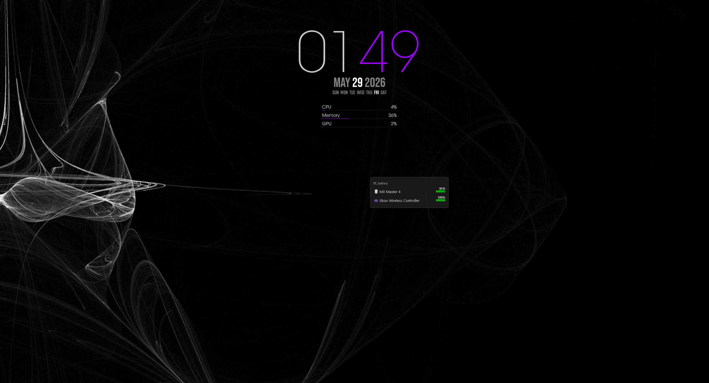
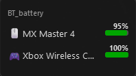
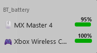
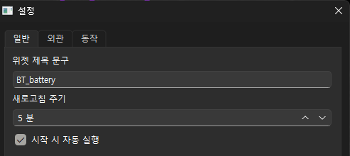
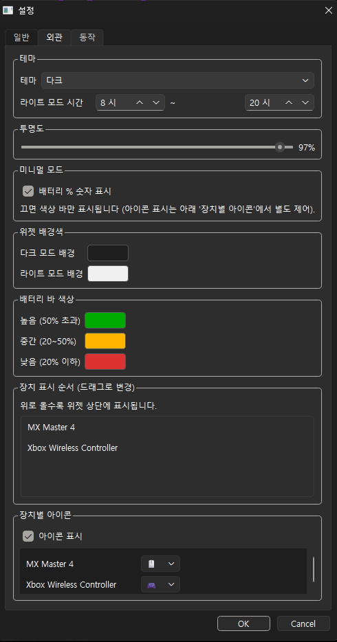
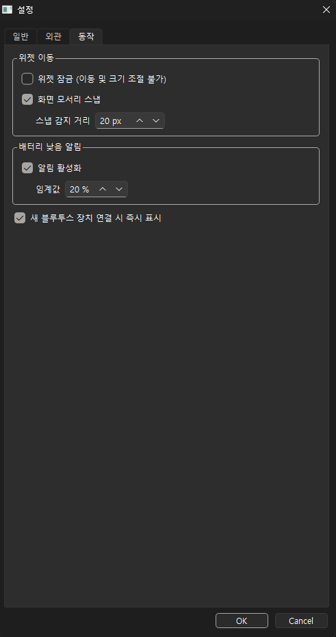

# BTBatteryWidget

페어링된 블루투스 장치의 배터리 잔량을 화면 위에 띄워주는 윈도우용 플로팅 위젯.
윈도우 설정 앱에 들어가야만 볼 수 있는 배터리 정보를, 항상 눈에 보이는 위치에 표시해주는 상주형 데스크탑 앱이다.

## 사용 화면



| 다크 모드 | 라이트 모드 |
|---|---|---|
|  |  |

## 주요 기능

- 페어링된 블루투스 장치의 배터리 잔량을 N분 주기로 자동 갱신 (주기 설정 가능)
- 배터리 구간별 색상 표시 (높음 / 중간 / 낮음, 임계값 사용자 지정 가능)
- 시스템 트레이 상주 (보이기/숨기기/즉시 새로고침/설정/종료)
- 새 장치 페어링 시 즉시 위젯에 표시
- 배터리 잔량이 임계값 아래로 떨어지면 토스트 알림
- 시작 프로그램 자동 등록 (`HKCU\Software\Microsoft\Windows\CurrentVersion\Run`)
- 위치 / 외관 / 동작 설정 저장 및 복원 (`AppData\Roaming\BTBatteryWidget\config.json`)
- 장치별 아이콘 선택 (장치 종류에 맞게 헤드폰 / 마우스 / 키보드 등으로 교체)
- 마우스로 위젯 크기 직접 조절 (가장자리 드래그)
- 모서리 스냅 (드래그 놓으면 가장 가까운 화면 모서리에 자동 정렬)
- 위젯 잠금 (이동 및 크기 조절 불가)
- 위젯 배경색 직접 지정 (다크 / 라이트 모드별 독립 설정)
- 장치 표시 순서 사용자 지정 (설정창에서 드래그로 변경)
- 미니멀 모드 (배터리 % 숫자 숨김, 색상 바만 표시)
- 다크 / 라이트 / 시간대 자동 전환 테마

## 기술 스택

| 분류 | 사용 기술 |
|---|---|
| 언어 | Python 3.11 |
| GUI | PyQt6 (frameless, always-on-top, 시스템 트레이) |
| 배터리 조회 | Windows SetupAPI (ctypes로 DLL 직접 호출) |
| 시작 프로그램 등록 | winreg (Windows Registry) |
| 설정 저장 | JSON (AppData 표준 경로) |
| 배포 | PyInstaller (`--onefile --windowed`) + Inno Setup |

## 기술적 결정 기록

### 1. 배터리 조회 방식: PowerShell → 레지스트리 → SetupAPI

블루투스 배터리 값을 어떻게 가져올지 세 가지 후보를 차례로 검증했다.

**1차 시도: PowerShell `Get-PnpDeviceProperty`**

가장 단순한 접근. `subprocess`로 PowerShell을 호출해 결과를 받아오는 방식.

- 동작은 했지만 매 폴링마다 새 프로세스를 띄움
- 5분 주기라 비용은 무시할 수준이지만, 외부 프로세스 의존이 찝찝함
- `CREATE_NO_WINDOW` 플래그로 콘솔창 깜빡임은 막을 수 있음

**2차 시도: 레지스트리 직접 읽기**

PowerShell이 어차피 내부적으로 어딘가에서 값을 읽는 거니, 그 출처를 직접 읽으면 외부 프로세스가 필요 없다고 가설을 세웠다.

```python
# 디버그용으로 작성한 레지스트리 덤프 스크립트
# HKLM\SYSTEM\CurrentControlSet\Enum\BTHENUM\... 트리 전체를 훑어
# DEVPKEY_Bluetooth_Battery GUID({104EA319-...} pid=2) 값을 찾는다
```

결과: **레지스트리에 배터리 값이 정적으로 저장되지 않음.** 드라이버가 요청 시점마다 동적으로 제공하는 값이라, 레지스트리에는 GUID 키 자체가 존재하지 않았다. 가설 폐기.

**3차 시도(최종 채택): SetupAPI를 ctypes로 직접 호출**

PowerShell이 내부적으로 호출하는 그 API를 우리도 직접 부른다. `setupapi.dll`의 `SetupDiGetClassDevsW` → `SetupDiEnumDeviceInfo` → `SetupDiGetDevicePropertyW` 체인.

```python
_setupapi = ctypes.WinDLL('setupapi', use_last_error=True)

# Bluetooth class GUID
_BT_CLASS = GUID(0xE0CBF06C, 0xCD8B, 0x4647, ...)

# DEVPKEY_Bluetooth_Battery
_BATTERY_KEY = DEVPROPKEY(
    GUID(0x104EA319, 0x6EE2, 0x4701, ...),
    2,
)
```

이렇게 했더니:

| 항목 | PowerShell 방식 | SetupAPI ctypes |
|---|---|---|
| 외부 프로세스 생성 | 매번 | 없음 |
| 폴링 1회 소요 시간 | 약 800ms | 약 5ms |
| 추가 의존성 | PowerShell 실행 환경 | 없음 (표준 라이브러리) |
| 콘솔창 깜빡임 위험 | 플래그로 차단 | 원천적으로 없음 |

비용 차이 자체보다 "외부 프로세스에 의존하지 않는다"는 점이 컸다. 빌드한 exe 하나로 모든 동작을 자기 프로세스 안에서 처리하게 됐다.

### 2. 설정 파일 위치: AppData JSON

윈도우 앱 설정 저장은 보통 네 가지 방식이 쓰인다.

| 방식 | 대표 사례 | 평가 |
|---|---|---|
| `AppData` + JSON | VS Code 등 | 사람이 읽기 좋고 디버깅 쉬움 |
| `AppData` + INI | 레거시 앱 | 구조화 데이터에 약함 |
| 레지스트리 | Chrome 등 | 표준이지만 불투명함 |
| 실행 파일 옆 저장 | 포터블 앱 | Program Files 설치 시 권한 문제 |

`AppData\Roaming\BTBatteryWidget\config.json`을 채택했다. 포터블 앱이 아닌 정식 설치형이라 실행 파일 옆에 저장은 Program Files 권한 문제로 부적합하고, 포트폴리오 관점에서 JSON이 코드 리뷰어가 설정 파일을 그대로 열어볼 수 있어 가장 투명하다.

### 3. 설정 변경 실시간 반영

설정창에서 슬라이더를 움직이거나 색상을 바꾸면 위젯에 즉시 반영된다. 단, "OK"를 눌러야 디스크에 저장되고 "Cancel"이면 변경 전 상태로 원복된다.

초기 구현은 OK를 눌러야만 위젯에 반영되는 방식이었는데, 투명도/색상은 직접 보면서 조절해야 적정값을 찾을 수 있다는 판단 하에 구조를 바꿨다.
```bash
설정 다이얼로그 열기 → 현재 config 백업
↓
값 변경 → 시그널로 위젯에 즉시 전달 (디스크 미저장)
↓
OK   → 디스크 저장
Cancel → 백업본으로 위젯 원복
```
### 4. 위젯 크기 조절: setFixedSize 제거 → 가장자리 드래그

초기에는 `setFixedHeight`로 장치 수에 맞게 높이를 자동 계산하고, 너비는 장치 이름 길이 기준으로 고정했다. 그런데 사용자마다 원하는 크기가 다르고, 직접 조절하는 게 훨씬 자연스럽다는 판단 하에 마우스 리사이즈를 구현했다.

가장자리 6px 범위를 감지해서 방향에 맞는 커서로 바꾸고, 드래그하면 해당 방향으로 크기가 변한다. 위젯 잠금이 켜져 있으면 리사이즈도 함께 막힌다.

## 프로젝트 구조
```bash
BTBatteryWidget/
├── src/
│   ├── init.py
│   ├── battery.py      # SetupAPI ctypes 호출 + Device 데이터클래스
│   ├── widget.py       # 플로팅 위젯 (frameless, 드래그, 리사이즈, 스냅)
│   ├── tray.py         # 시스템 트레이 아이콘 + 메뉴
│   ├── settings.py     # 설정 다이얼로그 (탭 구조)
│   ├── icon_picker.py  # 장치별 아이콘 선택 위젯
│   ├── config.py       # 설정 dataclass + JSON 로드/저장
│   └── main.py         # QApplication 엔트리포인트
├── images/
│   ├── widget_dark.png
│   ├── widget_light.png
│   ├── widget_minimal.png
│   ├── widget_desktop.png
│   ├── settings_general.png
│   ├── settings_appearance.png
│   └── settings_behavior.png
├── installer/
│   └── setup.iss       # Inno Setup 스크립트
├── build.spec          # PyInstaller 빌드 설정
├── requirements.txt
└── README.md
```

## 설정 항목

설정창은 세 개의 탭으로 구성되어 있다.

**일반**



- 제목 문구 변경
- 새로고침 주기 (1 ~ 60분)
- 시작 프로그램 자동 실행

**외관**



- 테마 (다크 / 라이트 / 시간대 자동)
- 투명도 슬라이더 (10% ~ 100%)
- 위젯 배경색 (다크 / 라이트 모드별 독립 지정)
- 미니멀 모드: 배터리 % 숫자 표시 여부
- 배터리 구간별 색상 (높음 / 중간 / 낮음)
- 장치 표시 순서 (드래그로 변경, 위젯 상단부터 순서대로 표시)
- 장치 옆 아이콘 표시 여부
- 장치별 아이콘 변경 (마우스 / 헤드폰 / 키보드 / 컨트롤러 등)

**동작**



- 위젯 잠금 (이동 및 크기 조절 불가)
- 모서리 스냅 + 감지 거리(px)
- 배터리 낮음 알림 활성화 + 임계값 지정 (%)
- 새 장치 페어링 시 즉시 반영

## 설치 및 실행

### 일반 사용자

릴리스 페이지에서 `BTBatteryWidget_Setup.exe`를 받아 실행한다. 설치 마법사에서 "시작 시 자동 실행" 옵션을 켜두면 부팅 시 자동으로 트레이에 올라간다.

### 개발자

```cmd
git clone https://github.com/HyeonBin0118/BTBatteryWidget.git
cd BTBatteryWidget

python -m venv venv
venv\Scripts\activate
pip install -r requirements.txt

python -m src.main
```

### 빌드 (exe 생성)

```cmd
pyinstaller build.spec
```

`dist/BTBatteryWidget.exe` 가 생성된다.

### 설치 파일 생성

Inno Setup Compiler에서 `installer/setup.iss`를 열어 컴파일하면 `BTBatteryWidget_Setup.exe`가 만들어진다.

## 동작 환경

- Windows 10 / 11
- 페어링된 블루투스 장치가 배터리 정보를 보고하는 경우에만 표시됨
  (윈도우 설정 앱의 "Bluetooth 및 장치" 화면에서 배터리 % 가 보이는 장치가 대상)

## 한계

- 윈도우 전용. macOS / Linux에서는 동작하지 않는다 (`setupapi.dll` 사용)
- 블루투스 표준 GATT Battery Service를 구현하지 않은 장치는 잡히지 않음. 이 경우 윈도우 자체에서도 배터리 표시가 안 되므로 앱의 책임 범위 밖이다.
- Apple 장치(AirPods 등)는 애플 독자 프로토콜을 사용하기 때문에 Windows에서 배터리 정보를 읽을 수 없다. 윈도우 설정 앱에서도 동일하게 표시되지 않는다.
- 전원 어댑터로 동작하는 블루투스 장치(스피커 등)는 배터리 자체가 없어 표시되지 않는다.

## 라이선스

MIT
